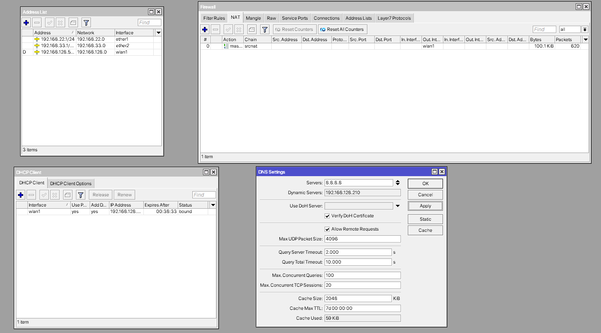

# LAB-48-Membatasi-akses-media-sosial-dan-membagi-bandwidth
Sabtu 6 September 2025  
  
  
# Konfigurasi
  
  Kita akan buat agar Kelas A dan B mendapatkan bandwidth yang sama dan tidak bisa mengakses TikTok pada jam 7 pagi sampai jam 10 pagi.  
1. Pertama pastikan kita sudah melakukan basic configurasi terlebih dahulu sampai router bisa terkoneksi ke internet.  
  
2. Selanjutnya kita bisa mulai dengan membuat IP Pool. Untuk menentukan range IP yang akan diberikan ke client. Di **IP > Pool > Add** isikan parameter rangea dan name.  
  
3. Jika sudah kita akan buat DHCP server. DHCP server ini bertugas untuk membagikan IP yang ada di IP Pool secara otomatis ke client tanpa client setting manual. **IP > DHCP SERVER > ADD**. Isikan parameter address pool, interface dan name.  
  
4. Selanjutnya beralih ke tab **Network** di samping tab DHCP. Dan tambahkan untuk masing-masing address. Fungsinya supaya client tahu gateway dan DNS.  
  
5. Jika sudah, selanjutnya kita bisa buat address list di **IP > FIREWALL > ADDRESS LIST**. Kita buat ini agar gampang dipanggil/jadi target di firewall atau mangle. Kalau tidak ada, kita harus tulis IP manual di tiap aturan.  
  
6. Selanjutnya pindah ke tab **Mangle** masih di Firewall. Mangle ini akan memisahkan/menandai traffik A dan B dengan mark. Pilih chain prerouting, action mark connection dan mark packet, dan jangan lupa masukan address listnya ke **src address list**.  
  
  
7. Jika sudah sekarang kita bisa buat Queue Treenya, kita akan mengunakan HTB. Pertama buat Parent nya dulu. Untuk Download kita bisa bisa pilih global dan Upload kita bisa pilih interface WAN. JIka sudah membuat parentnya sekarang kita buat child nya. Cocokan child dengan parent masing-masing dan jangan lupa isi **Packet Marks** nya.  

  
9. Jika sudah kita bisalanjut ke Layer7 protocol. Ini untuk deteksi URL sosial media. Tanpa Layer7, kita harus blok IP, padahal IP Facebook/TikTok sering berubah. Regex lebih fleksibel. Fungsinya untuk mencari pola (pattern) tertentu di dalam isi paket data (bukan hanya IP/port). Kalau ada paket data yang cocok dengan regex, maka dianggap cocok dengan L7 rule tersebut.
  
^ → artinya "awal teks".  

.+" → titik (.) = sembarang karakter, ditambah tanda plus (+) = boleh ada satu atau lebih karakter. Jadi artinya “boleh ada karakter apa saja di depan”.  

(facebook|fb) → bagian utama. Tanda | artinya OR (atau). Jadi cocok kalau ada kata facebook atau fb di dalam teks.  

.* → titik (.) = sembarang karakter, bintang (*) = bisa nol atau lebih banyak. Jadi artinya “boleh ada tambahan karakter apa saja setelahnya”.  

$ → artinya "akhir teks".  
9. Jika sudah kita bisa pindah ke Filter Rules untuk mendrop koneksinya. Kita akan set parameter time juga untuk mengatur waktunya dan jangan lupa untuk memasukan src address list.  
  
10. Lalu Blokir HTTPS via DNS Redirect. Jadi kalau ada yang pakai DNS alternatif (misalnya 1.1.1.1), aturan ini akan paksa semua permintaan DNS tetap lewat router, sehingga bisa kontrol domain yang diakses.  
  
  
# Pengujian
  Untuk tahap pengujian kita bisa mulai dari cek internet speednya.  
  Ini speed keadaan Q Tree nya mati  
    
  Dan ini speed dalam keadaan Q Treenya nyala  
    
  
  
  Dan sekarang kita coba apakah masih bisa mengakses TikTok.  
  Ini pengecekan diluar jam yang dimana Rulesnya dalam keadaan mati.  
    
    
  Dan ini saat didalam jam aturan yang dimana rulesnya menyala.  
    
    

# Sumber-Sumber Yang Terkait dengan Topik yang Dibahas  
- Citraweb - TUTORIAL QUEUE TREE DAN HTB MIKROTIK PALING LENGKAP - QOS [ENG SUB]  
https://youtu.be/tsW4kOM1L8g?si=zGytQzJQWUFgEET-  
- MikroTik - MikroTips: How to firewall  
https://youtu.be/hMj80ZIVBQs?si=j5TbeaJiUehqtCIL  
- MikroTik - Network Address Translation - NAT secrets they didn't tell you  
https://youtu.be/vt819u0QEtg?si=I_Y8Ga5GYU9E2s5y  
- MikroTik - Your first DHCP configuration  
https://www.youtube.com/watch?v=kF4b_t6W5fM  
